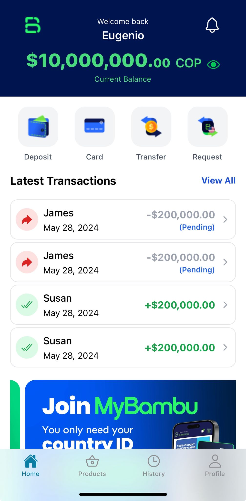

# MyBambu Expo App

Welcome to your modern Expo-powered mobile banking app! �


## 🏗️ App Structure & Technologies

- **Styling:** Uses [NativeWind](https://www.nativewind.dev/) for utility-first styling.
- **TypeScript:** All components are written in TypeScript (`.tsx` files).
- **React:** Functional components and React hooks only—no class components.
- **Componentization:** Layout is broken into clean, reusable components.
- **Mock Data:** The transactions list uses mock data for demonstration.

### Main UI Layout

- **Top Balance Header:**
  - Greeting, balance amount, and icons (e.g., bell, eye)
- **Action Buttons:**
  - Four buttons
- **Latest Transactions:**
  - Styled list items showing recent transactions (with mock data)
- **Static Banner:**
  - Banner image from api
- **Bottom Tab Bar:**
  - Icons only (no navigation logic required)

---

## 📱 App Preview


Below is a screenshot of the app running on an iPhone:




> **Note:** This app has only been tested on iPhone.

---

## Getting Started

1. **Install dependencies**
   ```bash
   cd test
   npm install
   ```
2. **Start the app**
   ```bash
   cd test
   npx expo start
   ```

You can open the app in:
- [Expo Go](https://expo.dev/go)

Start developing by editing files inside the **app** directory. This project uses [file-based routing](https://docs.expo.dev/router/introduction).

---

## 🧹 Resetting the Project

To reset and start fresh:
```bash
npm run reset-project
```
This will move starter code to **app-example** and create a blank **app** directory.

---

## 📚 Learn More
- [Expo documentation](https://docs.expo.dev/)
- [Learn Expo tutorial](https://docs.expo.dev/tutorial/introduction/)

---

## 🤝 Join the Community
- [Expo on GitHub](https://github.com/expo/expo)
- [Discord community](https://chat.expo.dev)
